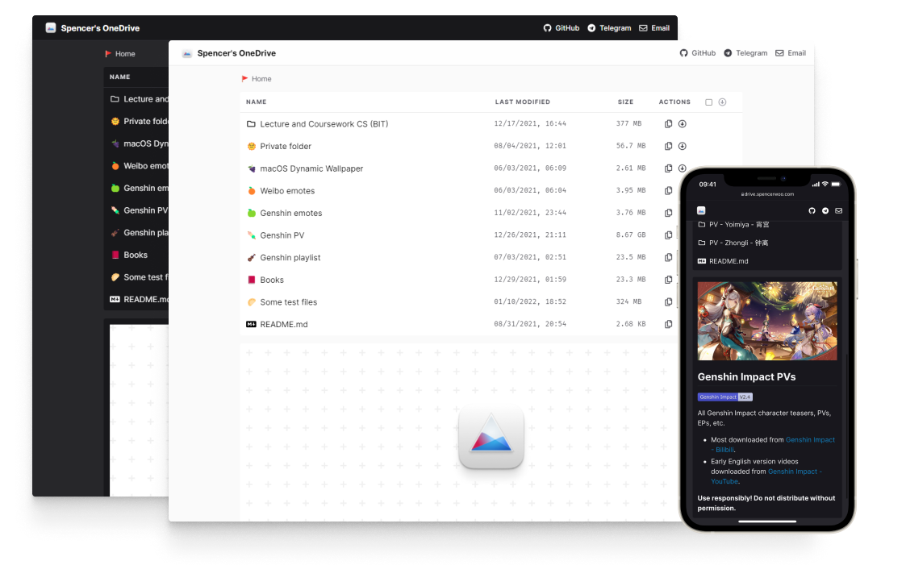

import Callout from 'nextra-theme-docs/callout'

# Getting started

## TL;DR

<Callout emoji="⚡️">Here's a quick guide on how to deploy your own VercelDrive.</Callout>

1. You don't even need to fork the repo! Use the [One-Click Deploy](https://vercel.com/new/git/clone?repository-url=https%3A%2F%2Fgithub.com%2FAstear17%2FVercelDrive) button.
2. Fill in the required environment variables during Vercel deployment (`NEXT_PUBLIC_SITE_TITLE`, `USER_PRINCIPAL_NAME`, `BASE_DIRECTORY`, `CLIENT_ID`, `CLIENT_SECRET`, `UPLOAD_PASSWORD`).
3. Set up an Upstash Redis database and add the `REDIS_URL` environment variable.
4. Redeploy and complete the OAuth authorization on your site. 🎉

VercelDrive handles authentication, stores tokens securely in Redis, and auto-closes the auth channel afterwards.

## Getting started (for real now!)

VercelDrive uses your OneDrive as a storage host, and displays the files, images, videos, songs, and documents stored inside your OneDrive for other people to preview, download, and upload.

## Microsoft Graph API Permissions

Before you deploy, you must configure a Microsoft Entra (Azure AD) App Registration with the correct API permissions. Since VercelDrive supports uploading files and creating folders, you must use these delegated Microsoft Graph permissions:

- `User.Read`
- `Files.ReadWrite.All`
- `offline_access`

<Callout emoji="⚠️" type="warning">
  Older versions of this app only required read-only access. If you are upgrading, you must upgrade your permissions to `Files.ReadWrite.All` and re-authenticate to allow file uploads.
</Callout>

## Environment Variables Configuration

Unlike older versions that required editing `config/site.config.js` and `config/api.config.js`, VercelDrive is configured entirely via environment variables. Prepare these values before deploying:

- `NEXT_PUBLIC_SITE_TITLE`: The title shown in the UI (e.g. `2Drive`)
- `USER_PRINCIPAL_NAME`: The OneDrive account email to access (e.g. `example@outlook.com`)
- `BASE_DIRECTORY`: Root OneDrive directory exposed by the site (e.g. `/` or `/Public Drive`)
- `CLIENT_ID`: Your Azure App Registration client ID
- `CLIENT_SECRET`: Your Azure client secret
- `UPLOAD_PASSWORD`: Password for server-side upload authorization gate

## Deploy to Vercel

Click the button below to start the one-click deployment:

### Create a Redis connection

The Redis database is used for storing OAuth `access_tokens` and `refresh_tokens`.

- We recommend using **Upstash Redis**, which is free and integrates fully with Vercel. 
- You can add the Upstash integration directly in Vercel to automatically inject the `REDIS_URL` environment variable.

### Redeploy on Vercel

Once `REDIS_URL` is set, trigger a redeployment in Vercel to apply the new environment variable. Then navigate to your deployed URL.

## Authenticate your VercelDrive

Visit your deployed site (e.g., `https://xxx.vercel.app`). You will be redirected to the OAuth setup page. Follow the instructions to get your authorization code, exchange it for tokens, and store them in Redis. 

<Callout emoji="📢">
  After a successful setup, VercelDrive will automatically close the OAuth authentication channel. This prevents unauthorized users from re-authenticating with your tokens.
</Callout>
