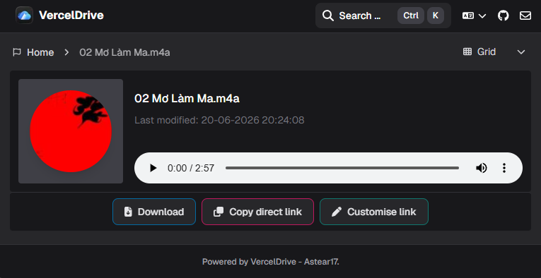
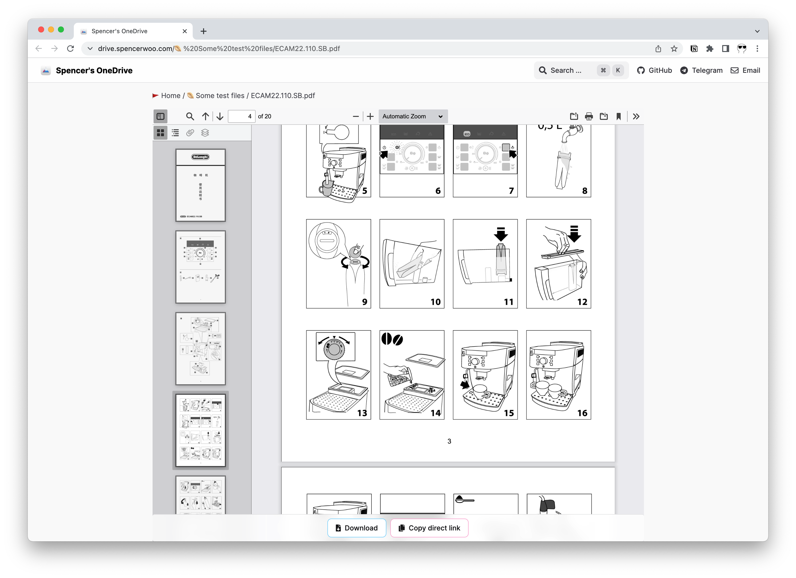
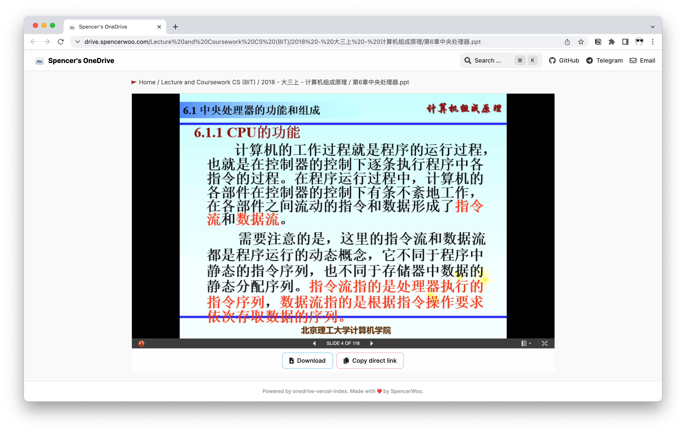
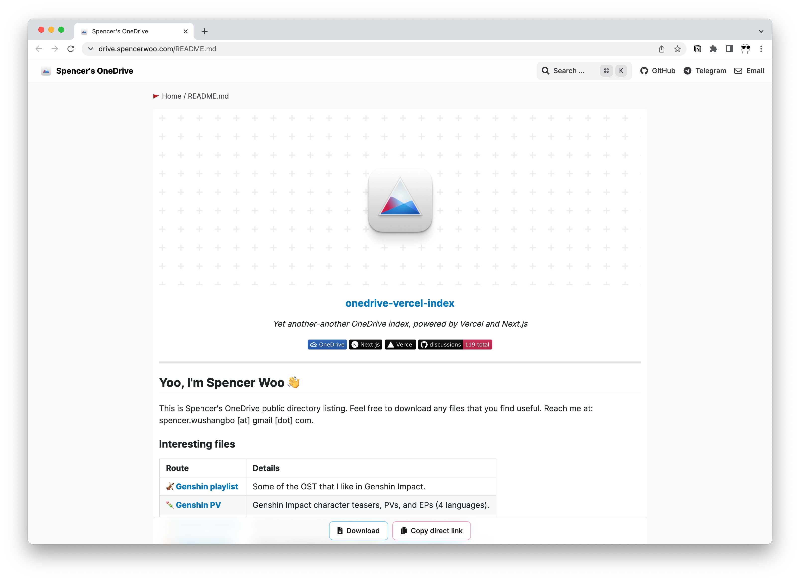

# File Preview

VercelDrive previews common OneDrive file types directly in the browser.

## Supported Preview Types

### Images

VercelDrive displays images inline with their natural aspect ratio.

### Video

Video files play in a built-in player with support for subtitles, quality selection, and keyboard shortcuts.

### Audio

Audio files play in a built-in player with standard playback controls.

### PDF

PDF files render in the browser with scroll and zoom support.

### Office Documents

Word, Excel, and PowerPoint files are previewed using browser-based embedding where available.

### Code

Source code files display with syntax highlighting.

### Markdown and Plain Text

Markdown files render as formatted HTML. Plain text files display with monospace formatting.

### EPUB

EPUB files open in a built-in e-reader.

### URL Shortcuts

URL shortcut files display the target link with an option to open it.

## Unsupported Formats

When a file type cannot be previewed, VercelDrive shows a default file card with file metadata and download actions.
