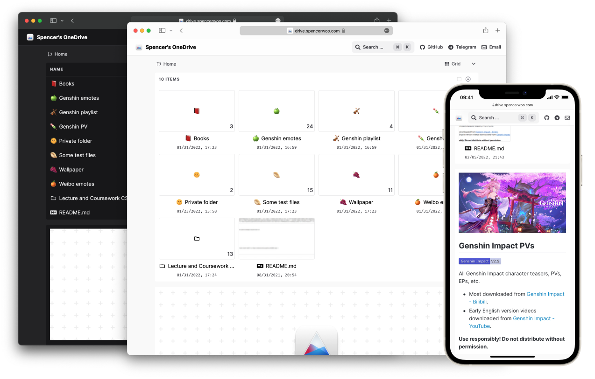

import Bleed from 'nextra-theme-docs/bleed'
import Features from '../components/features'

<h1 className="text-center font-extrabold md:text-5xl mt-8">VercelDrive</h1>

  OneDrive public directory listing and upload app, powered by Vercel and Next.js.

<Bleed>
  <Features />
</Bleed>

Showcase, share, preview, download, and upload files inside your OneDrive with `VercelDrive`. Simple one-click setup, serverless, and open source. Includes features like drag-and-drop uploads, large-file sessions, and password protection.

  <a className="inline-flex items-center rounded-md bg-black px-4 py-2 text-sm font-semibold text-white no-underline dark:bg-white dark:text-black" href="/docs/getting-started">Getting Started</a>
  <a className="inline-flex items-center rounded-md border border-gray-300 px-4 py-2 text-sm font-semibold no-underline dark:border-gray-700" href="/blog/whats-new">What's New</a>
  <a className="inline-flex items-center rounded-md border border-gray-300 px-4 py-2 text-sm font-semibold no-underline dark:border-gray-700" href="https://github.com/Astear17/VercelDrive">GitHub</a>

