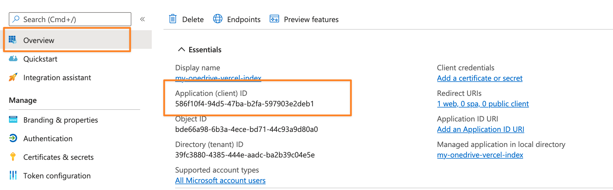
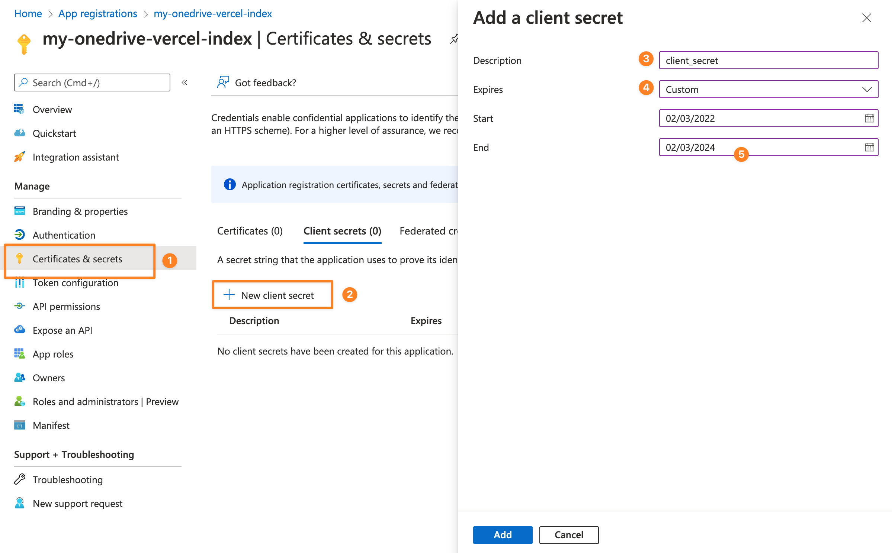
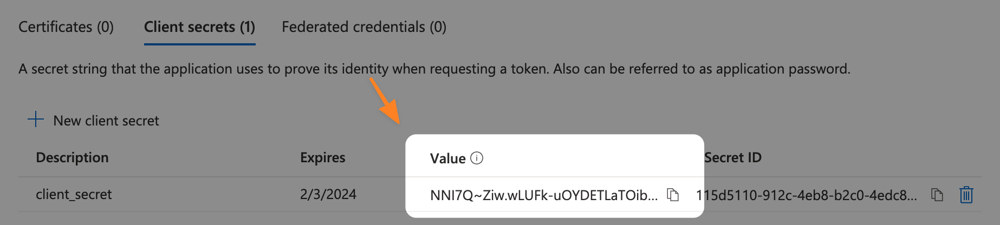
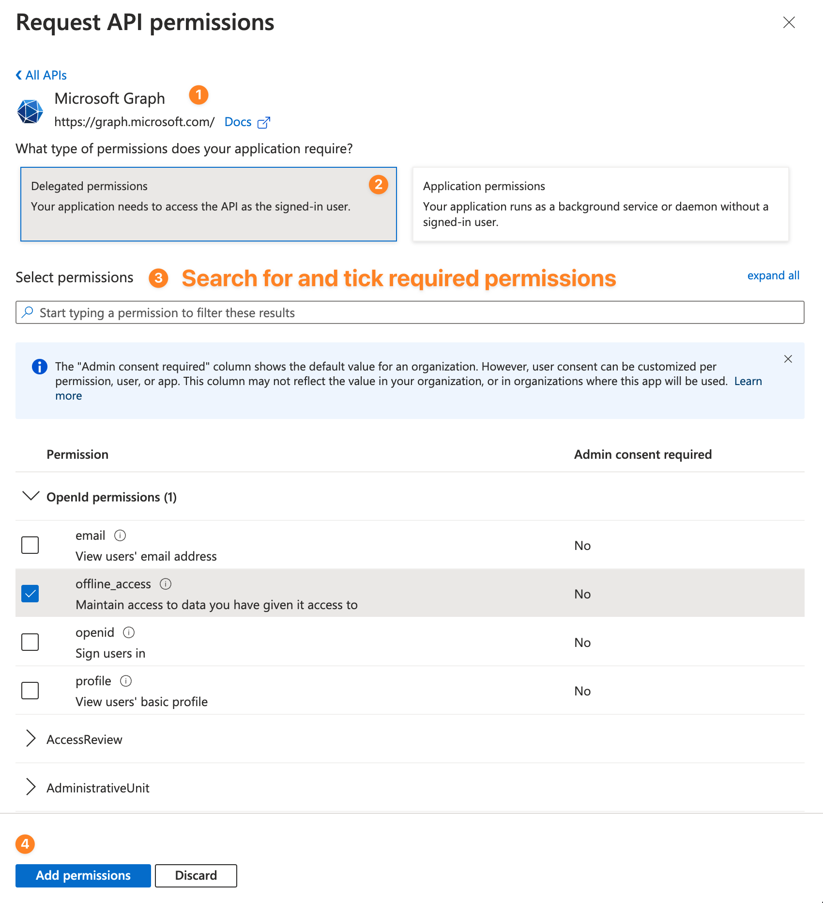

import { Callout } from 'nextra/components'
import Encryption from '../../../components/encryption'

# Nâng cao

Dùng trang này khi bạn cần tạo Microsoft Entra app riêng, đổi quyền API, bật tải lên hoặc hiểu các biến môi trường thay cho file cấu hình cũ.

## Đăng ký ứng dụng Microsoft Entra

Mở [Microsoft Azure App registrations](https://portal.azure.com/#blade/Microsoft_AAD_RegisteredApps/ApplicationsListBlade), đăng nhập bằng tài khoản Microsoft hoặc tenant sở hữu OneDrive, rồi tạo đăng ký mới.

Giá trị đề xuất:

1. Name: `VercelDrive`, hoặc tên dễ nhận biết.
2. Supported account types: accounts in any organizational directory and personal Microsoft accounts.
3. Redirect URI: `Web` và `http://localhost`.

Sau khi đăng ký, sao chép Application (client) ID. Đây là `CLIENT_ID`.



## Client Secret

Mở **Certificates & secrets**, tạo client secret mới và sao chép giá trị secret ngay lập tức. Microsoft chỉ hiển thị giá trị này một lần.





VercelDrive yêu cầu client secret được AES-obfuscate trước khi lưu vào `CLIENT_SECRET`.

<Encryption />

Kết quả sẽ giống như:

```text
U2FsdGVkX1830zo3/pFDqaBCVBb37iLw3WnBDWGF9GIB2f4apzv0roemp8Y+iIxI3Ih5ecyukqELQEGzZlYiWg==
```

## Quyền API

Mở **API permissions**, chọn **Microsoft Graph**, chọn **Delegated permissions**, rồi thêm scope theo chế độ bạn dùng.

### Chế độ chỉ đọc

Dùng chế độ chỉ đọc khi trang chỉ cần duyệt, xem trước, chia sẻ và tải xuống.

Quyền delegated bắt buộc:

- `User.Read`
- `Files.Read.All`
- `offline_access`

Không đặt `UPLOAD_PASSWORD` trong Vercel cho chế độ này.

### Chế độ đọc/ghi có tải lên

Dùng chế độ đọc/ghi khi cần tải tệp lên và tạo thư mục từ trình duyệt.

Quyền delegated bắt buộc:

- `User.Read`
- `Files.ReadWrite.All`
- `offline_access`

Đặt `UPLOAD_PASSWORD` trong Vercel. Có thể đặt thêm `UPLOAD_CONFLICT_BEHAVIOR` là `rename`, `replace` hoặc `fail`.



<Callout type="warning">
  Đổi quyền không cập nhật token OAuth đã lưu. Hãy xóa `<KV_PREFIX>access_token` và `<KV_PREFIX>refresh_token` trong Redis/KV, rồi xác thực lại.
</Callout>

## Biến môi trường (Environment Variables) và tài liệu liên quan

Các biến này thay thế cách cấu hình cũ trong `config/api.config.js` và `config/site.config.js`.

| Biến | Bắt buộc | Mô tả | Tài liệu liên quan |
| --- | --- | --- | --- |
| `NEXT_PUBLIC_SITE_TITLE` | Có | Tiêu đề hiển thị trên giao diện, ví dụ `2Drive` | [Tùy chỉnh cấu hình](./custom-configs#site-title) |
| `USER_PRINCIPAL_NAME` | Có | Email tài khoản OneDrive, ví dụ `example@outlook.com` | [Bắt đầu](./getting-started#3-chuan-bi-bien-moi-truong) |
| `BASE_DIRECTORY` | Có | Thư mục OneDrive gốc được hiển thị trên trang | [Tùy chỉnh cấu hình](./custom-configs#base-directory) |
| `CLIENT_ID` | Có | Application (client) ID từ Microsoft Entra App Registration | [Đăng ký ứng dụng](#dang-ky-ung-dung-microsoft-entra) |
| `CLIENT_SECRET` | Có | Client secret đã được AES-obfuscate bằng công cụ ở trên | [Client Secret](#client-secret) |
| `REDIS_URL` | Có | Chuỗi kết nối Redis (Upstash tự thêm khi tích hợp Vercel) | [Cache](./cache) |
| `UPLOAD_PASSWORD` | Chỉ khi bật upload | Mật khẩu phía máy chủ để bảo vệ việc tải lên | [Cổng mật khẩu tải lên](#cong-mat-khau-tai-len) |
| `NEXT_PUBLIC_PROTECTED_ROUTES` | Tùy chọn | Danh sách thư mục cần mật khẩu, phân tách bằng dấu phẩy | [Thư mục bảo vệ](./features/protected-folders) |
| `KV_PREFIX` | Tùy chọn | Tiền tố khóa Redis khi nhiều bản triển khai dùng chung Redis | [Cache](./cache) |
| `NEXT_PUBLIC_EMAIL` | Tùy chọn | Email liên hệ hiển thị ở header trang | [Tùy chỉnh cấu hình](./custom-configs#contact-email) |
| `UPLOAD_CONFLICT_BEHAVIOR` | Tùy chọn | Xử lý khi tải lên trùng tên: `rename`, `replace` hoặc `fail` | [Xử lý trùng tên](#xu-ly-trung-ten-khi-tai-len) |

Chỉ các biến thật sự cần xuất hiện trong trình duyệt mới nên bắt đầu bằng `NEXT_PUBLIC_`.

## Cổng mật khẩu tải lên

Upload được bảo vệ bằng `UPLOAD_PASSWORD`. Trình duyệt gửi mật khẩu đến `/api/upload/auth`, sau đó server đặt cookie xác thực upload ngắn hạn ở dạng HTTP-only. Các API upload vẫn kiểm tra quyền này ở phía server cho từng request.

Hành vi quan trọng:

- Không đặt `UPLOAD_PASSWORD` nghĩa là tắt upload.
- Mật khẩu không bao giờ là biến `NEXT_PUBLIC_`.
- Hộp nhập mật khẩu trên UI không phải ranh giới bảo mật; API route mới là nơi kiểm tra.
- Có thể kết thúc phiên upload bằng cách đăng xuất, chờ cookie hết hạn hoặc xóa cookie của trang.

## Xử lý trùng tên khi tải lên

`UPLOAD_CONFLICT_BEHAVIOR` kiểm soát khi tệp tải lên trùng tên với tệp đã có trong OneDrive.

Giá trị hỗ trợ:

- `rename`: giữ cả hai tệp và để OneDrive đổi tên tệp mới.
- `replace`: ghi đè tệp cũ.
- `fail`: từ chối upload nếu tệp đã tồn tại.

Nếu biến thiếu hoặc không hợp lệ, VercelDrive dùng `rename`.

## Reset token khi đổi quyền

Khi đổi quyền Microsoft Graph, hãy xóa token đã lưu trước khi xác thực lại.

Khóa Redis:

```text
<KV_PREFIX>access_token
<KV_PREFIX>refresh_token
```

Nếu `KV_PREFIX` trống, khóa sẽ là `access_token` và `refresh_token`.

Admin đã xác thực upload cũng có thể gọi:

```http
POST /api/upload/reset-auth-tokens
```

## Tên miền tùy chỉnh

Tên miền tùy chỉnh được cấu hình trong Vercel tại **Project Settings > Domains**. Xem [tài liệu Vercel về custom domain](https://vercel.com/docs/projects/domains).
