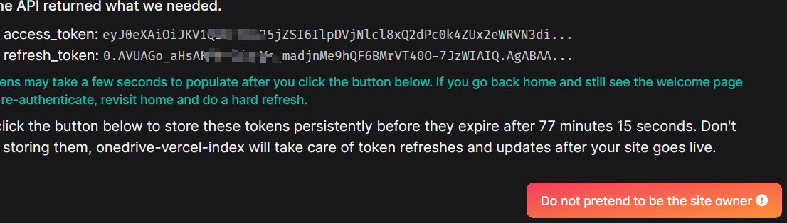

import { Callout } from 'nextra/components'

# "Đừng giả danh chủ sở hữu trang web"?

Nếu bạn thấy thông báo này ở bước thứ ba trong quá trình thiết lập ban đầu ...

Lý do là hệ thống cần xác minh **bạn** có thật sự là **bạn** trước khi lưu token vào cơ sở dữ liệu. Nếu thấy thông báo này, **email bạn đã cấu hình trong `USER_PRINCIPAL_NAME` là sai.**

Email này phải **hoàn toàn trùng khớp** với email bạn dùng để đăng nhập tài khoản Microsoft ở bước thứ hai của OAuth. Hãy kiểm tra lỗi chính tả, tên miền và chữ hoa/thường. **Phải trùng hoàn toàn!** 😡

<Callout emoji="💬">
  Các thảo luận liên quan:

- [Verify identity against site.json defined user during OAuth #241](https://github.com/Astear17/VercelDrive/discussions/241)
- [Do not pretend to be the site owner #250](https://github.com/Astear17/VercelDrive/discussions/250)
- [Google Drive Add #272 - what problem](https://github.com/Astear17/VercelDrive/discussions/272)

</Callout>
