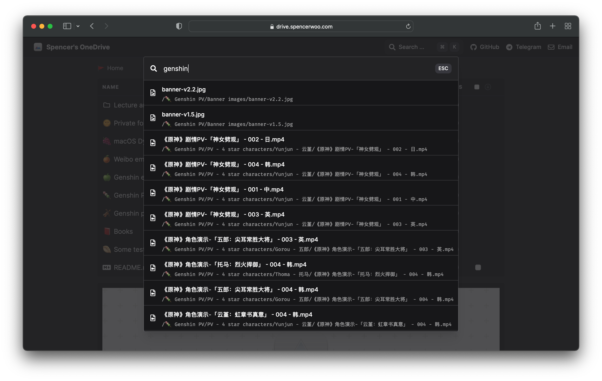

import { Callout } from 'nextra/components'

# Tìm kiếm tệp và thư mục

Tìm kiếm gốc hiện đã được hỗ trợ! Dùng `Ctrl` hoặc `⌘ + K` để mở hộp tìm kiếm, và `ESC` để đóng.

## Hạn chế

- Hỗ trợ hạn chế vì tìm kiếm qua Microsoft Graph API không hoàn hảo.
- Hỗ trợ rất hạn chế cho tìm kiếm CJK (tiếng Trung, Nhật, Hàn).

## Lưu ý bảo mật

Ngoài các hạn chế trên:

- **Kết quả tìm kiếm vẫn bao gồm các thư mục được bảo vệ**
- Nghĩa là **tên tệp** (dù nằm trong thư mục được bảo vệ hay không) đều bị lộ.
- Khách truy cập vẫn cần nhập mật khẩu nếu muốn xem nội dung tệp được bảo vệ.

<Callout emoji="🗣">
  Thảo luận tại: [Supporting search for all versions of OneDrive
  #295](https://github.com/Astear17/VercelDrive/discussions/295)
</Callout>
