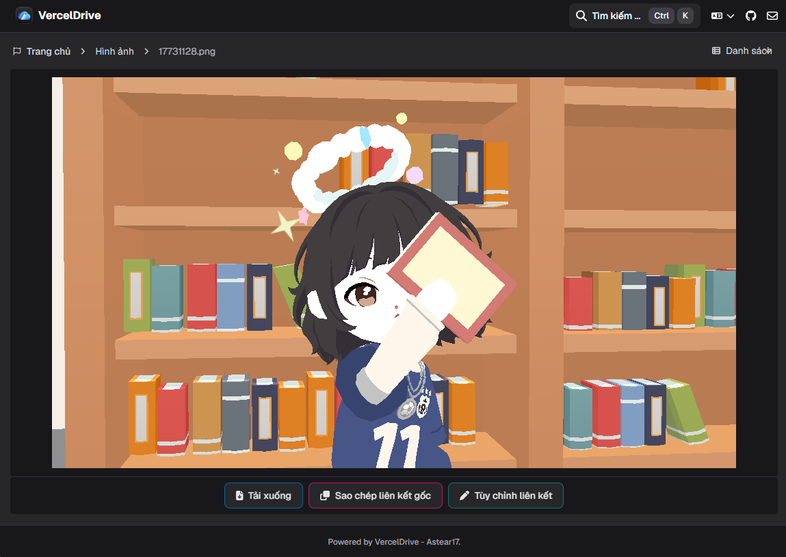
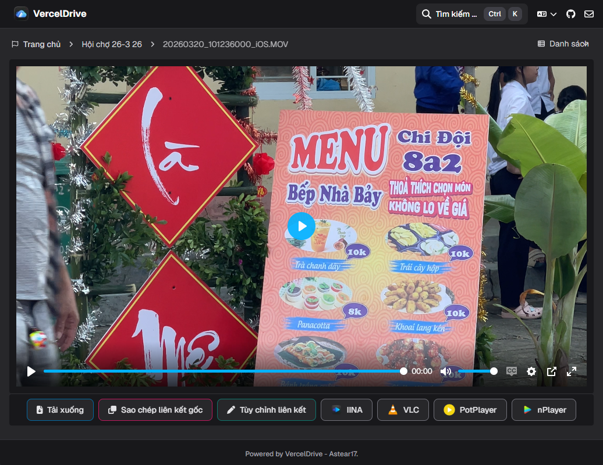
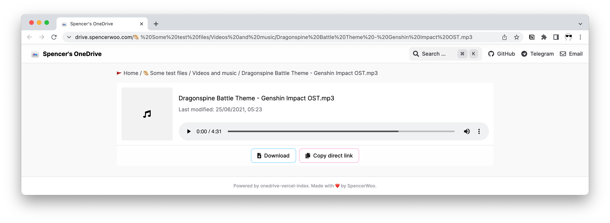
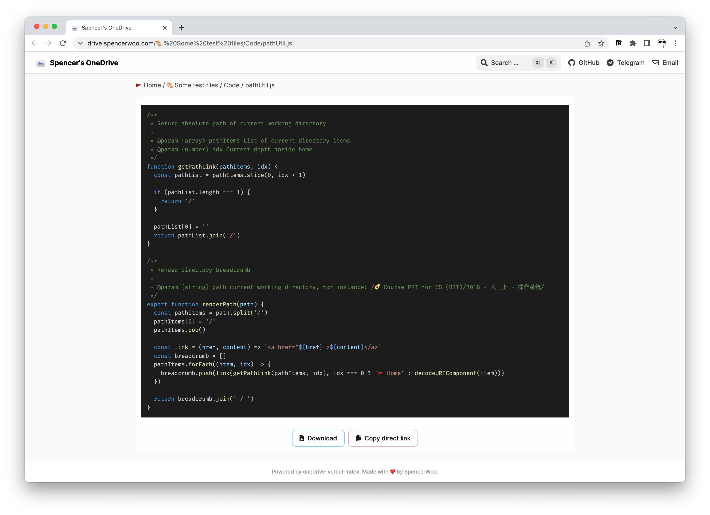
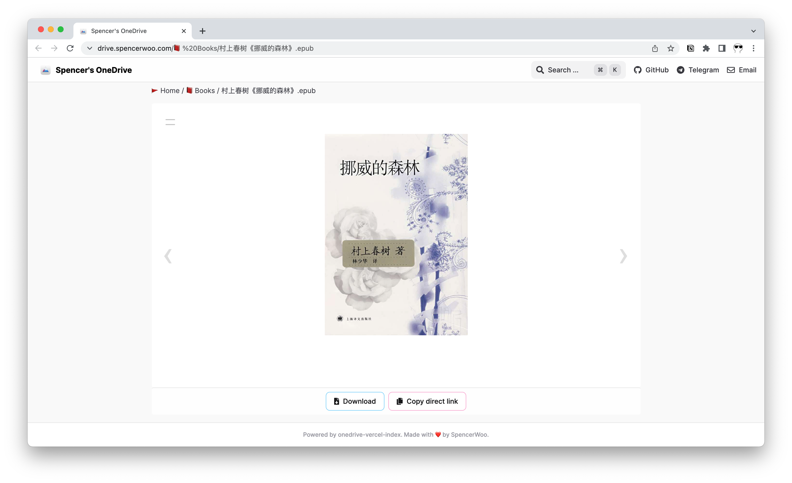
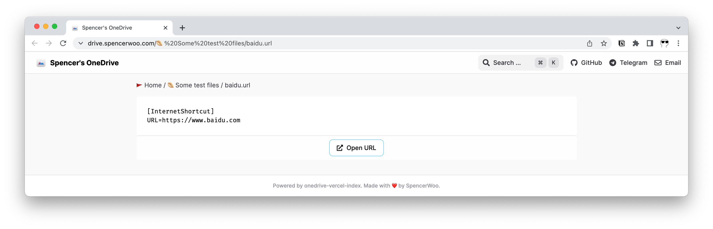

# Xem trước tệp

VercelDrive xem trước các loại tệp OneDrive phổ biến ngay trong trình duyệt.

## Loại tệp hỗ trợ xem trước

### Hình ảnh

VercelDrive hiển thị ảnh với tỷ lệ khung hình tự nhiên.

### Video

Tệp video phát trong trình chơi tích hợp với hỗ trợ phụ đề, chọn chất lượng và phím tắt.

### Âm thanh

Tệp âm thanh phát trong trình chơi tích hợp với điều khiển phát tiêu chuẩn.

### PDF

Tệp PDF hiển thị trong trình duyệt với hỗ trợ cuộn và phóng to.

### Tài liệu Office

Tệp Word, Excel và PowerPoint được xem trước bằng nhúng trình duyệt khi có hỗ trợ.

### Mã nguồn

Tệp mã nguồn hiển thị với tô sáng cú pháp.

### Markdown và văn bản thuần

Tệp Markdown hiển thị dưới dạng HTML được định dạng. Tệp văn bản thuần hiển thị với định dạng monospace.

### EPUB

Tệp EPUB mở trong trình đọc sách tích hợp.

### URL Shortcut

Tệp URL shortcut hiển thị liên kết đích với tùy chọn mở liên kết.

## Định dạng không hỗ trợ

Khi không thể xem trước một loại tệp, VercelDrive hiển thị card mặc định với metadata tệp và thao tác tải xuống.
