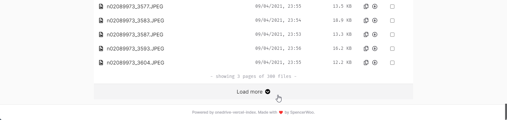

# Phân trang (Pagination)

OneDrive trả về thư mục lớn theo từng trang. VercelDrive tự động gọi tiếp API pagination ở nền và nối từng trang khi tải xong, nên người dùng không cần bấm thủ công sau mỗi 200 mục.

OneDrive API vẫn giới hạn mỗi trang ở 200 mục. Khi trang tiếp theo đang tải, VercelDrive hiển thị tiến trình ở cuối danh sách thư mục.

